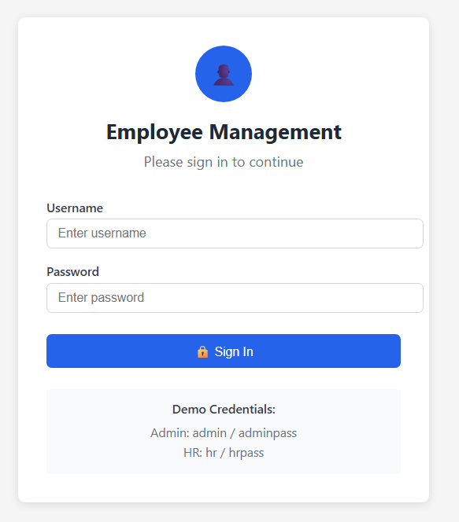
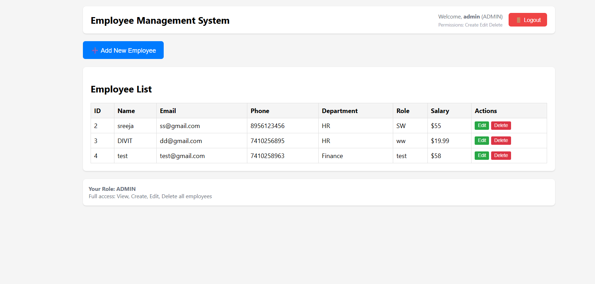
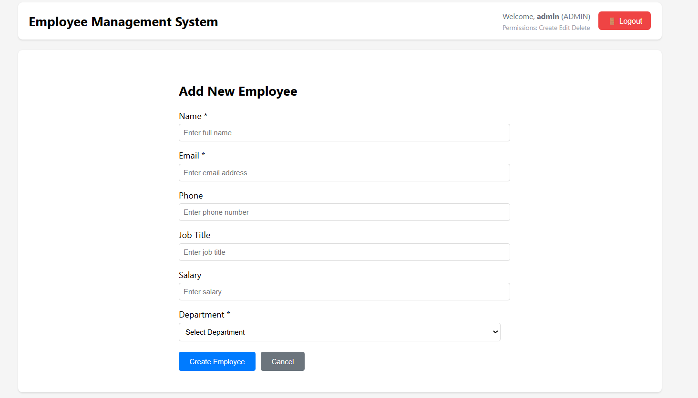
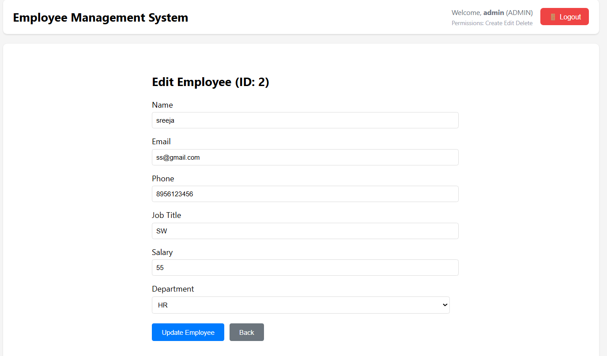
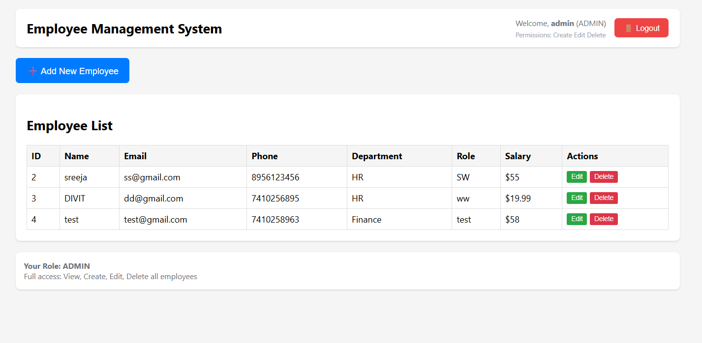
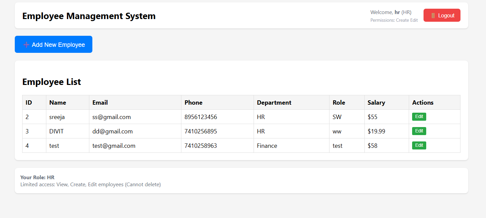

# 🏢 Employee Management System

A full-stack web application for managing employees with role-based access control, built with **Java Spring Boot** and **React.js**.


## 🖼️ Application Screenshots

### 🔐 Login System

*Secure authentication with role-based access control*

### 👥 Employee Dashboard

*Clean, professional interface showing all employees with action buttons*

### ➕ Add New Employee

*Intuitive form for creating new employee records*

### ✏️ Edit Employee Information

*Seamless editing experience with pre-populated data*

### 🛡️ Role-Based Permissions

#### Admin View (Full Access)

*Admin users can view, create, edit, and delete employees*

#### HR View (Limited Access)

*HR users can view, create, and edit employees (cannot delete)*

## 🚀 Features

- **🔐 User Authentication**: Secure login with username/password
- **👥 Role-Based Access Control**: Admin and HR roles with different permissions
- **📝 CRUD Operations**: Complete Create, Read, Update, Delete functionality
- **🏢 Department Management**: Organize employees by departments
- **💼 Employee Management**: Full employee lifecycle management
- **🎨 Clean UI**: Professional and responsive user interface
- **⚡ Real-time Updates**: Instant UI updates after operations

## 🛠️ Technology Stack

### Backend
- **Java 17**
- **Spring Boot 3.1.2**
- **Spring Security** - Authentication & Authorization
- **Spring Data JPA** - Database operations
- **H2 Database** - In-memory database for development
- **Maven** - Dependency management

### Frontend
- **React 18** - Modern JavaScript framework
- **JavaScript ES6+** - Modern JavaScript features
- **CSS3** - Responsive styling
- **Fetch API** - HTTP client for API calls

## 📦 Quick Start

### Prerequisites
- **Java 17+** installed
- **Node.js 16+** and npm installed
- **Git** for version control

### 1. Clone the Repository
```bash
git clone https://github.com/SreejaSreekumarSujatha/SreejaDevWorks.git
cd SreejaDevWorks
```

### 2. Backend Setup
```bash
# Navigate to backend directory
cd employee-management-backend

# Run the Spring Boot application
./mvnw spring-boot:run

# Backend will start on http://localhost:8080
```

### 3. Frontend Setup
```bash
# Navigate to frontend directory
cd employee-management-frontend

# Install dependencies
npm install

# Start the React application
npm start

# Frontend will start on http://localhost:3000
```

### 4. Access the Application
Open your browser and go to: **http://localhost:3000**

## 🔐 Demo Credentials

### 👨‍💼 Admin Access (Full Permissions)
- **Username**: `admin`
- **Password**: `adminpass`
- **Permissions**: View,  Create,  Edit,  Delete employees

### 👩‍💼 HR Access (Limited Permissions)  
- **Username**: `hr`
- **Password**: `hrpass`
- **Permissions**:  View, Create,  Edit employees |  Cannot delete

## 🎯 User Journey

### 1. Authentication Flow
[User] → [Login Page] → [Enter]

### 2. Admin Workflow
```
Login as Admin → View Employees → Add/Edit/Delete → Logout
```

### 3. HR Workflow  
```
Login as HR → View Employees → Add/Edit (No Delete) → Logout
```

## 🏗️ Project Architecture

```
employee-management-system/
├── 📁 backend/
│   ├── 🎮 controller/     # REST API endpoints
│   ├── 🏗️ model/         # Entity classes
│   ├── 💾 repository/     # Data access layer
│   ├── ⚙️ service/        # Business logic
│   └── 🔧 config/         # Security & configuration
├── 📁 frontend/
│   ├── ⚛️ components/     # React components
│   ├── 🎨 App.js          # Main application
│   └── 📄 index.js       # Entry point
├── 📁 images/             # Screenshots & diagrams
└── 📖 README.md
```

## 🔄 API Endpoints

| Method | Endpoint | Access | Description |
|--------|----------|--------|-------------|
| `GET` | `/api/employees` | Admin, HR | Get all employees |
| `GET` | `/api/employees/{id}` | Admin, HR | Get employee by ID |
| `POST` | `/api/employees` | Admin, HR | Create new employee |
| `PUT` | `/api/employees/{id}` | Admin, HR | Update employee |
| `DELETE` | `/api/employees/{id}` | Admin only | Delete employee |
| `GET` | `/api/departments` | All | Get all departments |

## 🛡️ Security Features

- **🔐 Spring Security**: Robust authentication framework
- **🎭 Role-Based Authorization**: Different permissions for user types
- **🔒 Basic Authentication**: Secure API access
- **✅ Input Validation**: Server-side data validation
- **🚫 CORS Protection**: Cross-origin request security

## 💾 Database Information

This project uses **H2 In-Memory Database** for easy demonstration:

- **Type**: In-memory database (resets on restart)
- **Access**: No external database setup required
- **Demo-Ready**: Perfect for portfolio demonstrations
- **H2 Console**: Available at `http://localhost:8080/h2-console`

### H2 Console Access (Optional)
- **JDBC URL**: `jdbc:h2:mem:employeedb`
- **Username**: `sa`
- **Password**: `password`

## 🚀 Live Demo

1. **🔑 Login**: Use demo credentials to access the system
2. **👀 View Employees**: Browse the employee list with all details
3. **➕ Add Employee**: Click "Add New Employee" to create records
4. **✏️ Edit Employee**: Click "Edit" button to modify employee data
5. **🗑️ Delete Employee**: Click "Delete" button (Admin only)
6. **🚪 Logout**: Click logout to end your session safely

## 📈 Key Achievements

- ✅ **Full-Stack Development**: Complete frontend and backend integration
- ✅ **Security Implementation**: Role-based access control
- ✅ **Modern Technologies**: Latest versions of Spring Boot and React
- ✅ **Professional UI**: Clean, intuitive user interface
- ✅ **Scalable Architecture**: Well-organized, maintainable codebase

## 🤝 Contributing

1. **Fork** the repository
2. **Create** a feature branch: `git checkout -b feature-name`
3. **Commit** your changes: `git commit -m 'Add feature'`
4. **Push** to the branch: `git push origin feature-name`
5. **Submit** a Pull Request

## 📝 License

This project is licensed under the **MIT License** - see the [LICENSE](LICENSE) file for details.

## 👨‍💻 Developer

Sreeja Sreekumar Sujatha


- 📧 Email: sreejasreekumarsujatha@gmail.com
- 🐙 GitHub: [@SreejaSreekumarSujatha](https://github.com/SreejaSreekumarSujatha)

---

⭐ **If you found this project helpful, please give it a star!** ⭐

📢 **This project demonstrates:**
- Full-stack web development
- RESTful API design  
- Authentication & authorization
- Database design
- Modern JavaScript frameworks
- Java enterprise development